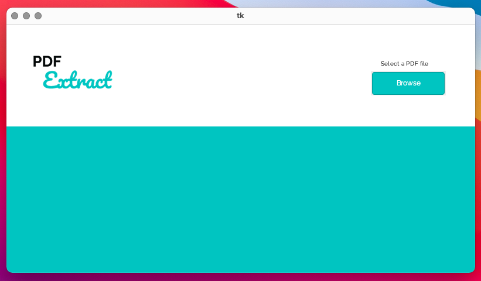
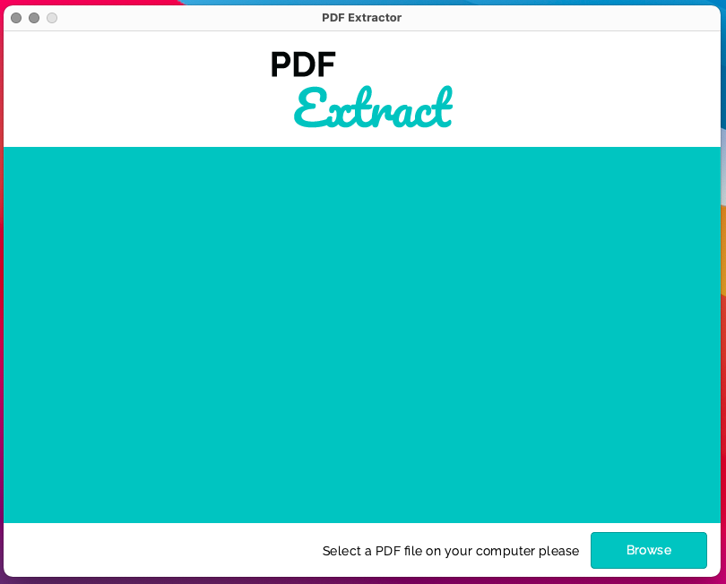
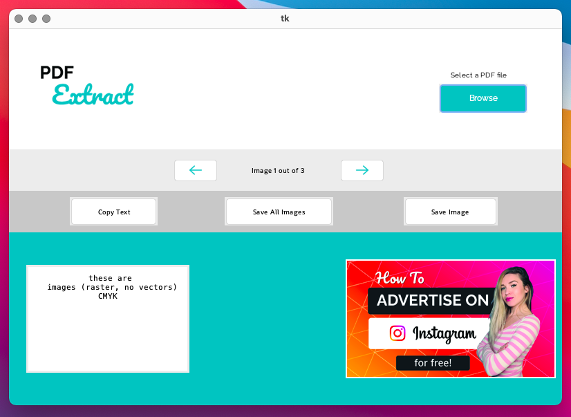
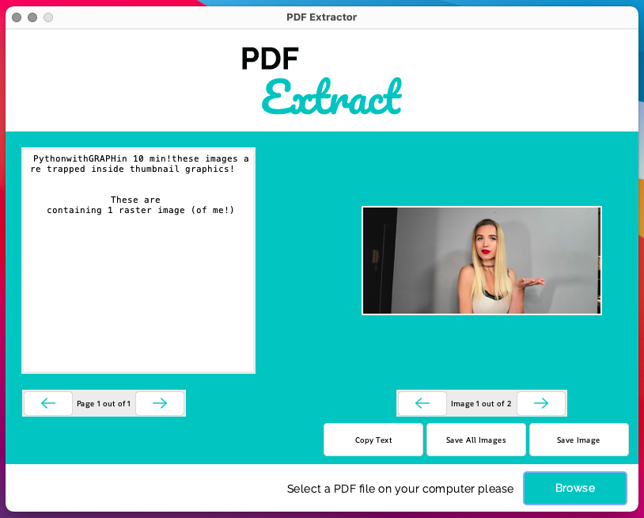

# pdf_extractor_py
___
PDF Extractor using Python and TKinter

## Update 2021-10-12
This App was build according to this two videos from Python Simplified's Channel on YoutTube (https://www.youtube.com/c/PythonSimplified/):

>Parte 1:
>- Script: main.py
>- Video URL: https://youtu.be/itRLRfuL_PQ

>Parte 2:
>- Script: app.py
>- Video URL: https://youtu.be/y8PR4lTAh5E

I had to use the library **_tkmacosx_** because background color changing doesn't work on MacOS.

>**Next Steps**
>- Refactor de Code: Use OOP to organize the code.
>- Redisign the App: Try to improve UI/UX.

Thank you to Mariya from Python Simplified for the tutorial to learn the basics of TKinter.

## Update 2021-10-16
Project was split into folders and created a new one for the new UXUI App.

>New Project Structure
>- Folder **video1**  
> Files corresponding to the first video. Script: main.py
>- Folder **video2**  
> Files corresponding to the second video. Script: app.py
>- Folder **uxui**  
> Files corresponding to the new uxui version. Script: app.py

>New UXUI Version
> The code has some changes need to build the new design, but it's still
> the same code like the one on the *video2* folder.   
> I also added a new control to change pages and not just the first one.   
> This app is not fully functional yet, I didn't want to spend time to make it
> work if my plan is to refactor all the code.  
>
| OLD STYLE | NEW STYLE |
| ---      | ---       |
|  |  |
|  |  |

>**Next Steps**
>- Refactor de Code:  
> -Use OOP to organize the code.  
> -Make code PEP8 compliant.
